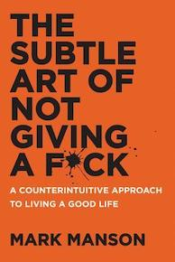

## Ch 1 Don't Try

* Charles Bukowski (poet)
* His success stemmed not from some determination to be a winner, but from the fact that he knew he was a loser, accepted it, and then wrote honestly about it. He never tried to be anything other than what he was.
* Fame and success didn't make him a better person. Nor was it by becoming a better person that he became famous and successful.
* Conventional life advice - all the positive and happy self-help stuff we hear all the time - is actually fixating on what you lack. It lasers in on what you perceive your personal shortcomings and failures to already be, and then emphasizes them for you.
* Giving too many fucks is bad for your mental health. It causes you to become overly attached to the superficial and fake, to dedicate your life to chasing a mirage of happiness and satisfaction. Key to a good life is not giving a fuck about more; it's giving a fuck about less, giving a fuck about only what is true and important.

#### Feedback Loop from Hell

Thoughts about our thoughts.

Wanting positive experience is a negative experience; accepting negative experience is a positive experience.

Everything worthwhile in life is won through surmounting the associated negative experience.

The avoidance of suffering, struggle, failure, is a form of suffering, struggle, failure. Hiding what is shameful is itself a form of shame.

#### The Backwards Law
The pursuit of positive experience is itself a negative experience.

The acceptance of negative experience is itself a positive experience.

#### Subtlety #1
Not giving a fuck does not mean being indifferent; it means being comfortable with being different.

#### Subtlety #2

To not give a fuck about adversity, you must first give a fuck about something more important than adversity.

#### Subtlety #3
Whether you realize it or not, you are always choosing what to give a fuck about.

---

## Ch 2 Happiness is a Problem

Dukkha - "life is suffering" (- Buddha)

Negative emotions have an inherent purpose.

Happiness comes from Solving Problems

Choose your struggle.

What pain do you want in your life? What are you willing to struggle for?

---

## Ch 3 You are not Special

Jimmy -> entitlement.

#### Two Forms of Entitlement

1. I'm awesome and the rest of you suck, so I deserve special treatment
2. I suck and the rest of you are all awesome, so I deserve special treatment.

(grandiose vs victim narcissism)

#### Things Fall Apart

#### Tyranny of Exceptionalism

We are filled w/ info from the extremes of the bell curve of human experience.

the tendency toward entitlement is apparent across all of society, and is linked to mass-media-driven exceptionalism.

the internet has not just open-sourced information; it has also open-sourced insecurity, self-doubt, and shame.

#### But, If I'm Not Going to be Special or Extraordinary, what's the point?

## Ch 4 The Value of Suffering

The story of Lt Hiroo Onoda. 

The question we should be asking is not "How do I stop suffering?" but Why am I suffering-for what purpose? 

#### The Self-Awareness Onion

1st layer - a simple understanding of one's emotions.

2nd layer - an abiity to ask why we feel certain emotions.

3rd layer - personal values. (Why do I consider this to be success/failure?)

Our values determine the nature of our problems, and the nature of our problems determines the quality of our lives.

#### Rock Star Problems

#### Shitty Values

#### Definiing Good and Bad Values

---

## Ch 5 You Are Always Choosing

#### The Choice

We are responsible for everything in our lives, no matter the external circumstances. We don't *always* control what happens to us. But we always control how we interpret what happens to us, as well as how we respond. Whether we consciously recognize it or not, we are always responsible for our experiences. It's impossible not to be. Choosing to *not* consciously interpret events in our lives is still an interpretation of the events of our lives.

#### The Responsibility/Fault Fallacy

Accepting responsibility for our problems is thus the first step to solving them.

Nobody else is ever responsible for your situation but you.

You always get to choose how you see things, how you react to things, how you value things. *You always get to choose the metric by which to measure your experiences.*

We all love to take responsibility for success and happiness. But taking responsibility for our problems is far more important.

#### Responding to Tragedy

#### Genetics and the Hand We're Dealt

#### Victimhood Chic

#### There Is No "How"

---

## Ch 6 You're Wrong About Everything